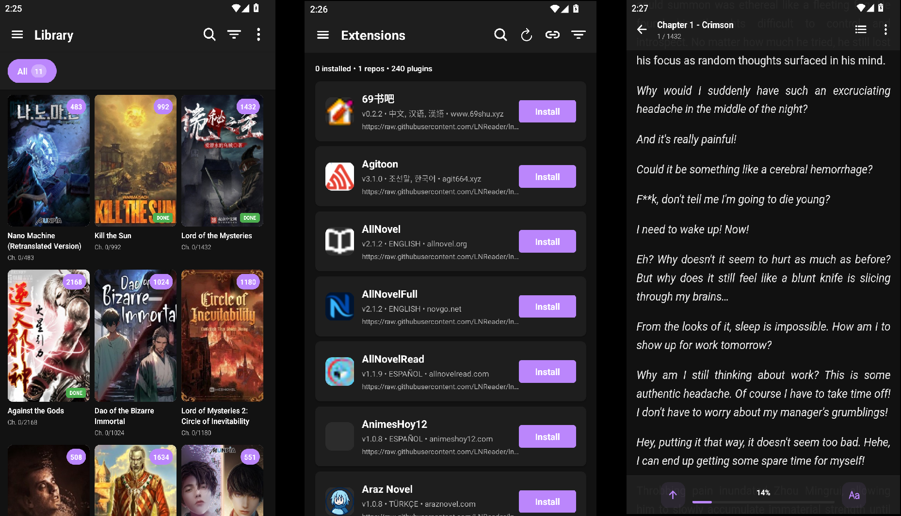

<!-- PROJECT SHIELDS -->
<div align="center">

[![Contributors][contributors-shield]][contributors-url]
[![Forks][forks-shield]][forks-url]
[![Stargazers][stars-shield]][stars-url]
[![Issues][issues-shield]][issues-url]
[![MIT License][license-shield]][license-url]

</div>

<!-- PROJECT LOGO -->
<br />
<div align="center">
  <a href="https://github.com/Virusilvester/NovelNest">
    
  </a>

<h3 align="center">NovelNest</h3>

  <p align="center">
    A beautiful, open-source light novel & web novel reader for Android
    <br />
    <a href="https://virusilvester.github.io/novelnest-web/"><strong>Explore the Website »</strong></a>
    <br />
    <br />
    <a href="https://github.com/Virusilvester/NovelNest/releases">Download APK</a>
    ·
    <a href="https://github.com/Virusilvester/NovelNest/issues/new?labels=bug&template=bug-report.md">Report Bug</a>
    ·
    <a href="https://github.com/Virusilvester/NovelNest/issues/new?labels=enhancement&template=feature-request.md">Request Feature</a>
  </p>
</div>

---

<!-- TABLE OF CONTENTS -->
<details>
  <summary>Table of Contents</summary>
  <ol>
    <li>
      <a href="#about-the-project">About The Project</a>
      <ul>
        <li><a href="#built-with">Built With</a></li>
      </ul>
    </li>
    <li>
      <a href="#getting-started">Getting Started</a>
      <ul>
        <li><a href="#prerequisites">Prerequisites</a></li>
        <li><a href="#installation">Installation</a></li>
      </ul>
    </li>
    <li><a href="#features">Features</a></li>
    <li><a href="#roadmap">Roadmap</a></li>
    <li><a href="#contributing">Contributing</a></li>
    <li><a href="#license">License</a></li>
    <li><a href="#contact">Contact</a></li>
    <li><a href="#acknowledgments">Acknowledgments</a></li>
  </ol>
</details>

---

<!-- ABOUT THE PROJECT -->
## About The Project

<div align="center">
  
</div>

<br />

NovelNest is a **free, open-source light novel and web novel reader** for Android, built with React Native and Expo. Inspired by apps like LNReader, it allows you to read novels from multiple online sources, download chapters for offline reading, and customize your reading experience.

### Why NovelNest?

- 📚 **Multi-Source Support** - Access light novels and web novels from various platforms
- 💾 **Offline First** - Download chapters and read anywhere, anytime  
- 🎨 **Beautiful Design** - Clean, modern UI with customizable themes
- 🔒 **Privacy Focused** - No ads, no tracking, no accounts required
- 🆓 **Completely Free** - Open source forever

<p align="right">(<a href="#readme-top">back to top</a>)</p>

### Built With

* [![Expo][Expo]][Expo-url]
* [![React Native][React-Native]][React-Native-url]
* [![TypeScript][TypeScript]][TypeScript-url]
* [![SQLite][SQLite]][SQLite-url]

<p align="right">(<a href="#readme-top">back to top</a>)</p>

---

<!-- GETTING STARTED -->
## Getting Started

### Prerequisites

* **Node.js** (v18 or higher recommended)
* **npm** or **yarn**
* **Expo CLI** (optional but recommended)
* **Android Studio** (for Android emulator) or physical Android device

### Installation

#### For Users (APK Install)

1. Download the latest APK from the [Releases](https://github.com/Virusilvester/NovelNest/releases) page
2. Enable "Install unknown apps" in your Android settings
3. Install and enjoy reading!

#### For Developers

1. Clone the repo
   ```sh
   git clone https://github.com/Virusilvester/NovelNest.git
   ```
2. Navigate to project directory
   ```sh
   cd NovelNest
   ```
3. Install dependencies
   ```sh
   npm install
   # or
   yarn install
   ```
4. Start the development server
   ```sh
   npx expo start
   ```
5. Run on Android device/emulator
   ```sh
   Press 'a' for Android
   ```

<p align="right">(<a href="#readme-top">back to top</a>)</p>

---

<!-- FEATURES -->
## Features

### Core Features
- [x] **Multi-Source Reading** - Browse and read from various light novel sources
- [x] **Offline Downloads** - Download chapters for offline reading
- [x] **Library Management** - Organize novels with categories and reading lists
- [x] **Reading Progress** - Track your reading position across devices
- [x] **Customizable Reader** - Fonts, themes, spacing, and reading direction
- [x] **Chapter Updates** - Check for new chapter releases
- [x] **Search & Discovery** - Find new novels by title, author, or genre

### Reader Features
- [x] **Multiple Reading Modes** - Paged or continuous scrolling
- [x] **Text Customization** - Font size, line spacing, margins
- [x] **Theme Support** - Light, dark, and sepia themes
- [x] **Orientation Lock** - Portrait or landscape reading
- [x] **Brightness Control** - In-app brightness adjustment

### Library Features
- [x] **Novel Organization** - Custom categories and filters
- [x] **Reading History** - Track completed and ongoing novels
- [x] **Backup & Restore** - Export/import your library data
- [x] **Update Notifications** - Know when new chapters drop

<p align="right">(<a href="#readme-top">back to top</a>)</p>

---

<!-- ROADMAP -->
## Roadmap

- [x] **Plugin System** - Support for custom source plugins
- [ ] **Cloud Sync** - Optional backup to cloud storage
- [ ] **Web Novel Support** - Enhanced web novel scraping
- [ ] **Reader Enhancements** - Text-to-speech, auto-scroll
- [ ] **Statistics** - Reading time tracking and stats
- [ ] **Community Features** - Reviews and recommendations
- [ ] **iOS Support** - Expand to iOS platform

See the [open issues](https://github.com/Virusilvester/NovelNest/issues) for a full list of proposed features and known issues.

<p align="right">(<a href="#readme-top">back to top</a>)</p>

---

<!-- CONTRIBUTING -->
## Contributing

Contributions are what make the open source community such an amazing place to learn, inspire, and create. Any contributions you make are **greatly appreciated**.

If you have a suggestion that would make this better, please fork the repo and create a pull request. You can also simply open an issue with the tag "enhancement".

### Development Setup

1. Fork the Project
2. Create your Feature Branch (`git checkout -b feature/AmazingFeature`)
3. Commit your Changes (`git commit -m 'Add some AmazingFeature'`)
4. Push to the Branch (`git push origin feature/AmazingFeature`)
5. Open a Pull Request

### Code Style

- Follow the existing code style and formatting
- Run `npm run lint` before committing
- Ensure TypeScript types are properly defined

<p align="right">(<a href="#readme-top">back to top</a>)</p>

---

<!-- LICENSE -->
## License

Distributed under the MIT License. See `LICENSE` for more information.

<p align="right">(<a href="#readme-top">back to top</a>)</p>

---

<!-- CONTACT -->
## Contact

Project Link: [https://github.com/Virusilvester/NovelNest](https://github.com/Virusilvester/NovelNest)

Website: [https://virusilvester.github.io/novelnest-web/](https://virusilvester.github.io/novelnest-web/)

<p align="right">(<a href="#readme-top">back to top</a>)</p>

---

<!-- ACKNOWLEDGMENTS -->
## Acknowledgments

* [LNReader](https://github.com/lnreader/lnreader) - Inspiration for this project
* [WebToEpub](https://github.com/dteviot/WebToEpub) - Inspiration for this project
* [Expo](https://expo.dev/) - React Native development platform
* [React Native](https://reactnative.dev/) - Mobile app framework
* [Tachiyomi](https://github.com/tachiyomiorg/tachiyomi) - Reference for source architecture

<p align="right">(<a href="#readme-top">back to top</a>)</p>

---

<!-- MARKDOWN LINKS & IMAGES -->
<!-- https://www.markdownguide.org/basic-syntax/#reference-style-links -->
[contributors-shield]: https://img.shields.io/github/contributors/Virusilvester/NovelNest.svg?style=for-the-badge
[contributors-url]: https://github.com/Virusilvester/NovelNest/graphs/contributors
[forks-shield]: https://img.shields.io/github/forks/Virusilvester/NovelNest.svg?style=for-the-badge
[forks-url]: https://github.com/Virusilvester/NovelNest/network/members
[stars-shield]: https://img.shields.io/github/stars/Virusilvester/NovelNest.svg?style=for-the-badge
[stars-url]: https://github.com/Virusilvester/NovelNest/stargazers
[issues-shield]: https://img.shields.io/github/issues/Virusilvester/NovelNest.svg?style=for-the-badge
[issues-url]: https://github.com/Virusilvester/NovelNest/issues
[license-shield]: https://img.shields.io/github/license/Virusilvester/NovelNest.svg?style=for-the-badge
[license-url]: https://github.com/Virusilvester/NovelNest/blob/master/LICENSE

[Expo]: https://img.shields.io/badge/Expo-000020?style=for-the-badge&logo=expo&logoColor=white
[Expo-url]: https://expo.dev/
[React-Native]: https://img.shields.io/badge/React_Native-20232A?style=for-the-badge&logo=react&logoColor=61DAFB
[React-Native-url]: https://reactnative.dev/
[TypeScript]: https://img.shields.io/badge/TypeScript-007ACC?style=for-the-badge&logo=typescript&logoColor=white
[TypeScript-url]: https://www.typescriptlang.org/
[SQLite]: https://img.shields.io/badge/SQLite-07405E?style=for-the-badge&logo=sqlite&logoColor=white
[SQLite-url]: https://www.sqlite.org/
